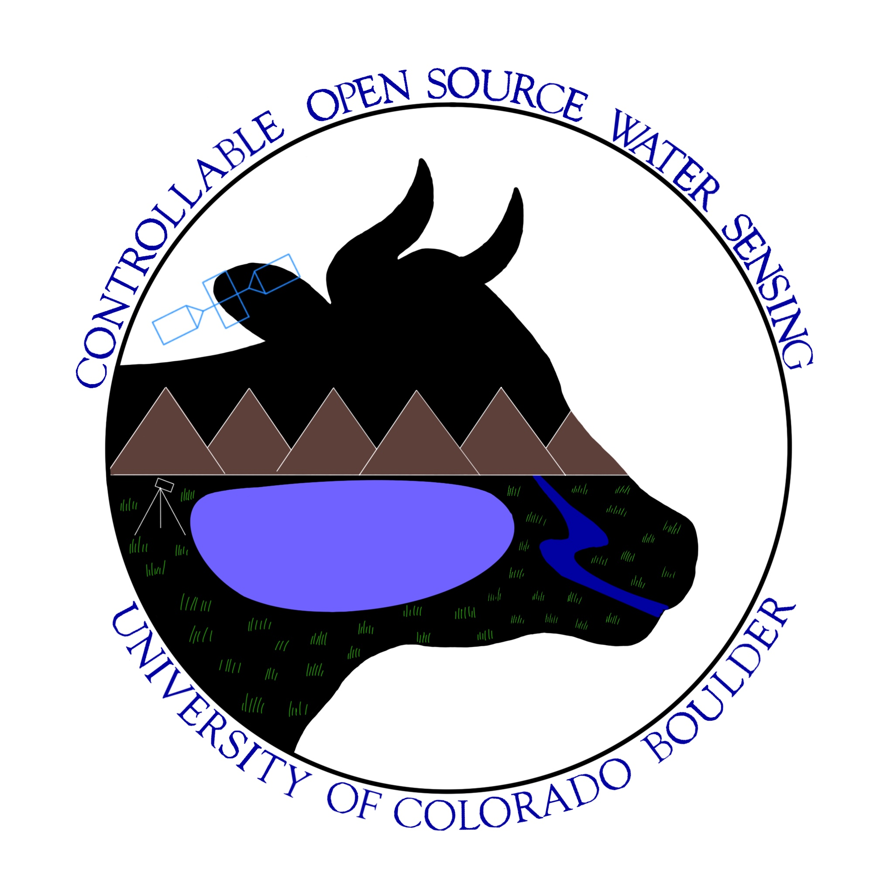

# Controllable Open-Source Water Sensing (COWS)   Deployable System & Ground Station Software

## Introduction
This GitHub repository contains documentation and the source code for Controllable Open-Source Water Sensing (COWS), a senior design project at University of Colorado Boulder Smead Aerospace. This repository has code for BOTH the deployable system and ground station software. Please note that this repository is currently boiler-plate and will be filled out and documented as the project continues to form through April 2024.

# Deployable System
## Getting Started
0. The prefered development environment for this is Linux and Windows, but MacOS users can stil achieve this with some legwork
1. Download Visual Studio Code
> sudo apt install code
2. Install the following extensions: 
> code --install-extension ms-python.python
>
> code --install-extension visualstudioexptteam.vscodeintellicode
>
> code --install-extension ms-python.vscode-pylance
>
> code --install-extension paulober.pico-w-go
3. You will need to configure some permissions to allow the Code IDE to access serial devices from your computer. Follow these steps from the MicroPico wiki. The rest of this repository also has a setup guide you may reference if you need some more help.
> https://github.com/paulober/MicroPico/wiki/Linux
4. If you have a pi pico, connect it and run code:
> export PICO_SDK_PATH=/home/pi/pico/pico-sdk
>
> code
5. Navigate into the /micropython/pico/ directory in this repository. If you have a raspberry pi pico with micropython connected, you can also test running your code from this location, as it is all setup.
6. Go nuts!
## Style & Format
We are going to be using an event-based programming style to run the software using interrups. Our focal on this is Blake, who has taken the Microavionics course. For individual scripts and functions, we can just get started and work to connect it all together later. Hopefully this will enable us to get the code written first, since there is plenty to do, and get it all playing nice once that major step is complete. If you have any suggestions or resources on this, please share!

# Ground System Software
The ground system software is entirely contained within a single docker container with two instances, one for Node.JS and another for a PostgreSQL database.
## Getting Started
0. 